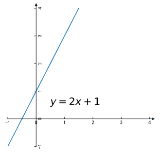
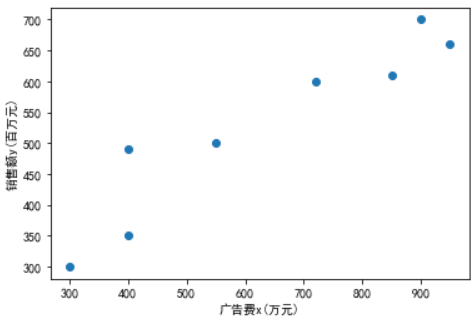
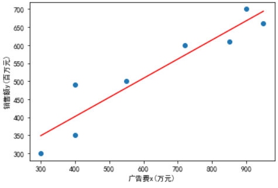
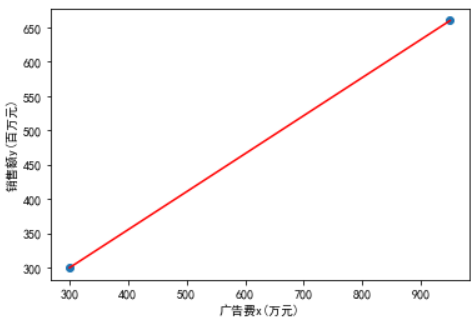
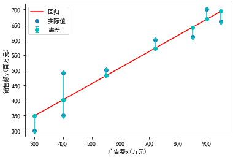

# 一元线性回归


人工智能里，最容易让人理解的应该就是 **回归**， 这个用xls都可以做


开篇必须说几个概念，早就懂和不愿意看的直接跳过


- **回归**
    - 回归，指研究一组随机变量(Y1 ，Y2 ，…，Yi)和另一组(X1，X2，…，Xk)变量之间关系的统计分析方法，又称多重回归分析
    - 通常Y1，Y2，…，Yi是因变量，X1、X2，…，Xk是自变量
- **一元线性回归**
    - 回归分析只涉及到两个变量的，称一元回归分析
    - 当Y=f(X)的形式是一个直线方程时，称为一元线性回归


## 线性方程


我们初中时候就学过 **线性方程** (*linear equation*)


线性方程有一个 **斜截式** (*slope intercept form*)


y = kx + b


比如我们让k=2，b=1





## 代码实现


这个非常简单，一行代码就可以实现


Python
```py
def linear(x):
    return x * 2 + 1
```


javascript
```js
function linear(x) {
    return x * 2 + 1;
}
```


简单来说，y=2x+1就是训练后的模型


我们的 **人工智能** 做的，就是找出这个 *2* 和 *1*


其实可以理解为y=kx+b的方程，已知y和x求k和b


# 回归分析


回归分析是通过规定因变量和自变量来确定变量之间的因果关系，建立回归模型


我们拿百度百科里面的数据来做一下分析


https://baike.baidu.com/item/%E4%B8%80%E5%85%83%E7%BA%BF%E6%80%A7%E5%9B%9E%E5%BD%92%E6%96%B9%E7%A8%8B


这里给了广告费和销售额的一组数据


广告费x(万元)|销售额y(百万元)
-- | --
300|300
400|350
400|490
550|500
720|600
850|610
900|700
950|660


画散点图展示





其实这个是有一个趋势的，我们可以用一条线表示出来，这就是回归





## 确定方程


我们中学时候学过，两点确定一条直线


如果我们只有两个数据可以确定一条直线


广告费x(万元)|销售额y(百万元)
-- | --
300|300
950|660





## 最小平方法


选择多，烦恼多，那么多点，怎么确定直线呢？


那么就看每个点到这个直线的距离的和最小，那么说明误差最小


实际的y减去预测的模型算出来的y称为 **离差**





# 回归模型


y<sub>i</sub> = &#945; + &#946;x<sub>i</sub> + &#949;<sub>i</sub>


我们可以先不管&#949;<sub>i</sub>(之后会详细介绍)


只看y<sub>i</sub> = &#945; + &#946;x<sub>i</sub>


那么，多个已知x和y求&#945;和&#946;我们一步一步看


> 就是刚才的y=kx+b就是换了个名字


^2)


> &#8721;就是总共n个数字的组合，加载一起，还不懂就看看高中数学书，找“西格玛”


因为


所以我们最后得到方程式


![$\sum\limits_{i=1}^n[y_i - (\alpha + \beta x_i)]^2$](https://latex.codecogs.com/png.latex?\sum\limits_{i=1}^n[y_i%20-%20(\alpha%20+%20\beta%20x_i)]^2)


我们求这个方程的最小值


利用 **微分法** 得到两个正规方程


然后把方程变成求&#945;和&#946;


(y_i%20-%20\bar{y})}}{\sum{(x_i%20-%20\bar{x})^2}}%20=%20\frac{n\sum{x_i%20y_i}%20-%20\sum{x_i}%20\sum{y_i}}{n\sum{x_i^2}%20-%20(\sum{x_i})^2}%20\\\\%20\alpha%20=%20\frac{\sum{y_i}}{n}%20-%20\beta%20\times%20\frac{\sum{x_i}}{n}%20=%20\bar{y}%20-%20\beta\bar{x}%20\end{cases})


## 代码实现


数学公式看不懂没关系，咱们直接上代码就是了


Python


定义一个类计算
```py
class Regression:
  def __init__(self, x, y):
    self.n = len(x)
    self.x = np.array(x)
    self.y = np.array(y)
  def getBeta(self):
    self.beta = (np.sum(self.x * self.y) * self.n - np.sum(self.x) * np.sum(self.y)) / (self.n * np.sum(self.x ** 2) - np.sum(self.x) ** 2)
    return self.beta
  def getAlpha(self):
    self.alpha = np.average(self.y) - self.beta * np.average(self.x)
    return self.alpha
```


实际的值带进去


```py
x = [300,400,400,550,720,850,900,950]
y = [300,350,490,500,600,610,700,660]
regression = Regression(x, y)
"b=%f, a=%f" % (regression.getBeta(), regression.getAlpha())
```


最后我们得到了


```
'b=0.530961, a=189.753472'
```


我们的公式就是 y = 189.753472 + 0.530961 * x


在我们的散点图上表现一下


# 细节拆分


咱们一步步来计算一下，并且该用js语言，既然手撕，最大的好处就是前后台都可以用


我们先拿出公式(只要找出公式，就可以还原人工智能的“机器学习”)


^2})


上面的式子我们一个个解释，顺便用代码实现，先定义x和y


```js
const x = [300,400,400,550,720,850,900,950];
const y = [300,350,490,500,600,610,700,660];
const n = x.length;
```

## 拆解1


这个就是说让每个x和y相乘，然后再加一起，最终的值再乘以n


就是


```
(300*300 + 400*350 + 400*490 + ... + 950*660) * 8
```


代码表现一下


```js
let sum = 0
for( const i in x) {
  sum += x[i] * y[i];
}
console.log(sum * n);
```


## 拆解2


做完刚才的，这个就简单了吧，就是所有的x加和，乘以所有y的加和


也就是


```
(300+400+400+...+950) * (300+350+490+...+660)
```


代码表现一下


```js
let sumx = 0
for(const num of x) {
  sumx += num;
}
let sumy = 0;
for(const num of y) {
  sumy += num;
}
console.log(sumx * sumy)
```


## 拆解3


这次是指数函数了，就是x的每个值的平方加起来，最后再乘以n


```
(300*300 + 400*400 + 400*400 + ... + 950*950) * n
```


代码


```js
let sum = 0;
for(const num of x) {
  sum += num ** 2;
}
console.log(sum * n);
```


## 拆解4


^2)


这个是所有x加和，最后再平方


```
(300+400+400+...+950) * (300+400+400+...+950)
```


代码


```js
let sum = 0;
for(const num of x) {
  sum += num;
}
console.log(sum ** 2);
```


## 整合


最后这四部就可以合并起来了获得最终的beta


```js
funciton sum(arr, fun = (v, k) => v) {
  let s = 0;
  const operate = fun;
  for(const i in arr) {
    const num = arr[i];
    s += operate(num, i);
  }
  return s;
}
const beta = (sum(x, (v, k) => v * y[k]) * n
                  - sum(x) * sum(y)) /
                (sum(x, (v) => v*v) * n  
                  - Math.pow(sum(x), 2));
console.log(beta);
```


## alpha


&#913;比较简单就用y的均值减去&#914;乘以x的均值就可以了


```js
funciton avg(arr) {
  let sum = 0;
  for(const num of x) {
    sum += num;
  }
  return sum / arr.length;
}

console.log(avg(y) - beta * avg(x))
```


## 创建回归模型


最后我们可以写一个类，获取这个线性回归


```js
class Regression {
  constructor() {
    this.x = [];
    this.y = [];
    this.n = 0;
    this.beta = 1;
    this.alpha = 0;
  }
  /**
   * 适配
   * @param {Array} x 
   * @param {Array} y 
   */
  fit(x, y) {
    this.x = x;
    this.y = y;
    this.n = x.length;
    this.beta = this.getBeta();
    this.alpha = this.getAlpha(this.beta);
  }
  /**
   * 预测
   * @param {Array}  x 数据集
   * @returns {Array} 预测结果数据集
   */
  predict(x) {
    if(!Array.isArray(x)) x = [x];
    const y = [];
    for(const num of x) {
      y.push(this.alpha + num * this.beta);
    }
    return y;
  }
  /**
   * 获取beta
   * @returns {Number}  斜率
   */
  getBeta() {
    const beta = (this.sum(this.x, (v, k) => v * this.y[k])*this.n 
                  - this.sum(this.x)*this.sum(this.y)) /
                (this.sum(this.x, (v)=>v*v) * this.n  
                  - Math.pow(this.sum(this.x), 2));
    return beta;
  }
  /**
   * 获取alpha
   * @param {Number} beta 斜率
   * @returns {Number}  偏移量
   */
  getAlpha(beta) {
    return this.avg(this.y) - this.avg(this.x) * beta;
  }
  /**
   * 求和(Σ)
   * @param {Array} arr 数字集合
   * @param {Function}  fun 每个集合的操作方法
   */
  sum(arr, fun = (v, k) => v) {
    let s = 0;
    const operate = fun;
    for(const i in arr) {
      const num = arr[i];
      s += operate(num, i);
    }
    return s;
  }
  /**
   * 均值
   * @param {Array} arr 数字集合
   */
  avg(arr) {
    const s = this.sum(arr);
    return s / arr.length;
  }
}
export default Regression;
```


只要加载这个类，就可以做 **一元线性回归** 的预测了


```js
import Regression from './regression.mjs'

const regression = new Regression() // 构造回归模型
const x = [300,400,400,550,720,850,900,950];
const y = [300,350,490,500,600,610,700,660];
regression.fit(x, y); // 训练模型
const predictions = regression.predict([200, 1000]); // 预测数据
console.log(predictions);
```


怎么样，js照样写人工智能


源码:


- https://gitee.com/thales-ucas/manuai.git
- https://github.com/thales-ucas/manuai.git